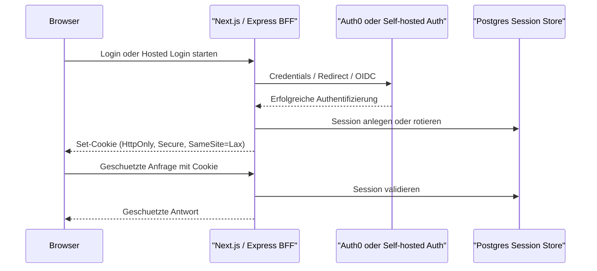
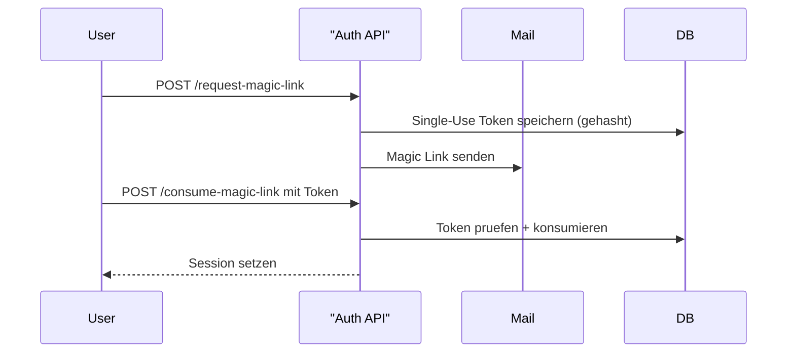
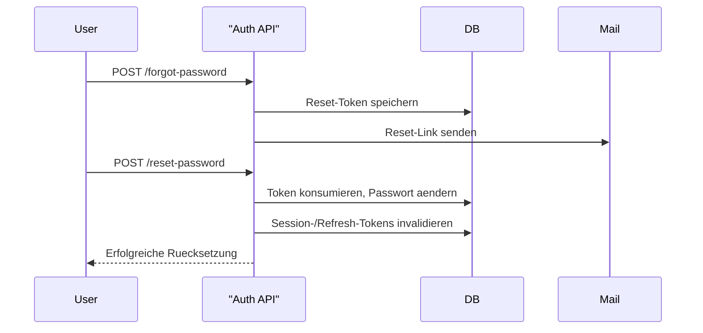
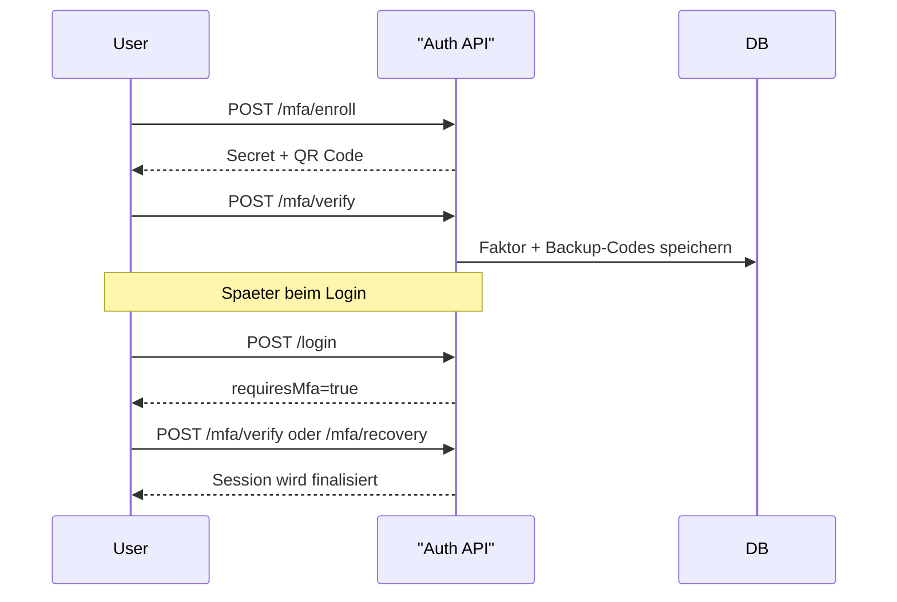
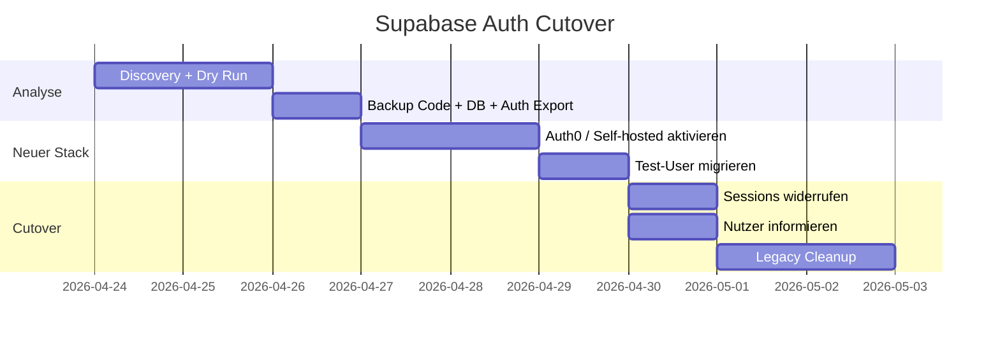

# Your Voice Auth Architecture

## Executive Summary

Dieses Repository enthaelt jetzt zwei produktionsnahe Referenzen:

1. **Managed Provider:** Auth0 + Next.js App Router mit serverseitigen Sessions, gehostetem Login und BFF-Muster.
2. **Self-hosted:** Node/Express + Passport.js + Postgres-Session-Store mit E-Mail/Passwort, Magic Links, Passkeys, MFA, Refresh-Token-Rotation und Audit-Logging.

Die bestehende Supabase-Auth im Frontend gilt ab jetzt als **Legacy Auth**. Sie wird nicht blind geloescht, sondern ueber einen dokumentierten Cutover mit Dry-Run, Backup, Testmigration und Session-Invalidierung abgeloest.

## Architekturentscheidung

- Browser-Clients: **HttpOnly + Secure + SameSite=Lax Session-Cookies**.
- API-Clients: optional getrenntes JWT-Modell mit rotierenden Refresh Tokens.
- Session-Store: **Postgres** in der self-hosted Referenz.
- CSRF: **Double-Submit Cookie** mit `/api/auth/csrf` bzw. `/api/auth/csrf-token`.
- Passwort-Hashes: **Argon2id**.
- Step-up / Re-Authentication: fuer sensible Aenderungen ueber `reauthAt`.

## Auth0 + Next.js

Wichtige Dateien:

- `/Users/benten09/Documents/Codex/2026-04-21-ich-werde-dir-gleich-eine-gesamte-2/lib/auth0.ts`
- `/Users/benten09/Documents/Codex/2026-04-21-ich-werde-dir-gleich-eine-gesamte-2/middleware.ts`
- `/Users/benten09/Documents/Codex/2026-04-21-ich-werde-dir-gleich-eine-gesamte-2/app/auth/page.tsx`
- `/Users/benten09/Documents/Codex/2026-04-21-ich-werde-dir-gleich-eine-gesamte-2/app/protected/page.tsx`
- `/Users/benten09/Documents/Codex/2026-04-21-ich-werde-dir-gleich-eine-gesamte-2/app/api/auth/session/route.ts`
- `/Users/benten09/Documents/Codex/2026-04-21-ich-werde-dir-gleich-eine-gesamte-2/app/api/auth/csrf/route.ts`

Erforderliche Auth0-Konfiguration:

- Allowed Callback URLs:
  - `http://localhost:3000/auth/callback`
  - `https://your-voice.example/auth/callback`
- Allowed Logout URLs:
  - `http://localhost:3000`
  - `https://your-voice.example`
- Allowed Web Origins:
  - `http://localhost:3000`
  - `https://your-voice.example`
- Scopes:
  - `openid profile email offline_access`
- Connections:
  - Datenbankverbindung fuer E-Mail/Passwort
  - Passwordless Email fuer Magic Links
  - Social Connections z. B. Google/GitHub
  - Passkeys / WebAuthn aktivieren
  - MFA / Guardian aktivieren

Hinweise:

- **Data Residency / DSGVO:** Tenant-Region, Log-Retention, EU-Hosting und DPA vor Go-Live pruefen.
- **Passkeys / MFA / Magic Links:** in Auth0 Dashboard ueber Universal Login, Passwordless und Guardian aktivieren.

## Self-hosted Node/Express

Pfad:

- `/Users/benten09/Documents/Codex/2026-04-21-ich-werde-dir-gleich-eine-gesamte-2/server/self-hosted`

Enthaltene Flows:

- Registrierung
- E-Mail-Verifikation
- Login / Logout
- Forgot Password / Reset Password
- Account Recovery
- Magic Link
- MFA Enrollment / Verify / Disable / Recovery
- Passkey Register / Login
- OAuth/OIDC Social Login (generischer Provider)
- API-Access-Token + Refresh-Token-Rotation
- Audit-Logging

## Security-Checkliste

- `HttpOnly`, `Secure` in Produktion, `SameSite=Lax` fuer Session-Cookies
- `__Host-` Prefix in Produktion vorbereitet
- CORS mit expliziter Allowlist
- kein `*` mit Credentials
- CSRF-Schutz auf allen zustandsaendernden Requests
- Rate Limiting fuer Login, Reset, Magic Link, MFA, Refresh
- Argon2id fuer Passwoerter und Opaque Tokens
- Session-Rotation nach Login
- Session-/Refresh-Token-Invalidierung bei Passwortaenderung und Cutover
- strukturierte Audit-Events ohne Secrets

## Mermaid-Diagramme

### Login / Session Flow

### Magic-Link-Flow

### Passwort-Reset-Flow

### MFA-Enrollment / Login-Flow

### Supabase-Migration / Cutover

## Monitoring und Alerts

- auffaellig viele Login-Fehler pro IP oder pro Identifier
- hoher Passwort-Reset- oder Magic-Link-Traffic
- MFA-Fehlerraten
- Refresh-Token-Rotation-Fehler
- ungewoehnliche Geo-/IP-Muster, sofern datenschutzrechtlich freigegeben

## Incident Playbook fuer Credential Leak

1. betroffene Secrets rotieren
2. alle Sessions / Refresh Tokens widerrufen
3. Passwort-Reset fuer betroffene Nutzer erzwingen
4. MFA-Re-Enrollment falls notwendig
5. Audit-Logs und Blast Radius auswerten
6. Nutzerkommunikation versenden

## Rollback

- Legacy-Supabase-Auth bis zum finalen Cutover im Code behalten
- Backups aus `backups/` bereithalten
- Cutover nur mit Recovery- und Session-Invalidierungsplan durchfuehren
